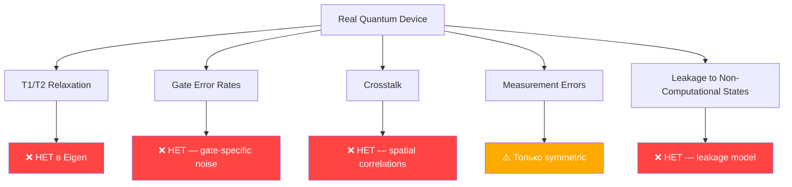

# Eigen — Полный аудит проекта и план развития v2.6 «Misery»

> **Дата:** 2026-07-01
> **Статус:** Планирование релиза 2.6 «Misery»
> **Тесты:** 449 passed / 0 failures
> **Размер кодовой базы:** ~550 файлов, ~120k строк кода

---

## 📊 Сводка текущего состояния

| Компонент | Зрелость | Оценка | Комментарий |
|---|---|---|---|
| Лексер/Парсер | ✅ Стабильный | 8/10 | Rust + Python fallback, Pratt-precedence |
| Компилятор (EBC) | ✅ Рабочий | 7/10 | 29k строк, байткод v2, SSA |
| VM | ✅ Стабильный | 7/10 | 50k строк, integer dispatch, hardened |
| JIT | ⚠️ Хак | 5/10 | Генерация Python кода → `exec()` |
| AOT/LLVM | ⚠️ Эксперимент | 4/10 | 38k строк llvm_codegen, QIR, но не production |
| Симулятор (Dense) | ✅ Хороший | 8/10 | NumPy + Rust backend, 1010 строк |
| Симулятор (Sparse) | ✅ Рабочий | 7/10 | 17k строк, честное масштабирование |
| Стабилизатор | ✅ Хороший | 7/10 | CHP-алгоритм, O(n²), только Clifford |
| MPS/Tensor | ⚠️ Базовый | 6/10 | Есть bond dim, SVD, но нет авто-тюнинга |
| Noise Models | ⚠️ Минимальный | 5/10 | 83 строки! 5 моделей, нет корреляций |
| Routing (SABRE) | ✅ Рабочий | 7/10 | 3 роутера, 477 строк, протестировано |
| ZX Calculus | ⚠️ Базовый | 5/10 | Spider fusion, pivoting, complementation |
| GPU Engine | ⚠️ Stub | 3/10 | CuPy/PyTorch обёртка, 123 строки |
| Resource Estimator | ⚠️ Минимальный | 4/10 | 71 строка, только подсчёт гейтов |
| Инсталлятор | ⛔ Примитивный | 2/10 | PyInstaller --onefile, нет мастера |
| Документация | ⚠️ Средняя | 6/10 | README хороший, но docs/ не полные |
| Stdlib | ⚠️ Минимальная | 4/10 | 7 модулей, по 200-600 строк каждый |
| Package Manager | ⚠️ Базовый | 5/10 | Init/add/install есть, registry stub |

---

## 🔴 ЧАСТЬ 1: КРИТИЧЕСКИЕ ПРОБЛЕМЫ (что ИСПРАВИТЬ)

### 1.1 JIT через генерацию Python-кода — бутылочное горлышко

**Файлы:** [jit_compiler.py](file:///d:/Nuras-7/src/jit/jit_compiler.py), [native_codegen.py](file:///d:/Nuras-7/src/jit/native_codegen.py)

**Проблема:** JIT компилятор генерирует **строки Python-кода** через строковую конкатенацию, а затем вызывает `compile()` + `exec()`:

```python
# jit_compiler.py:139
code_obj = compile(source, '<jit_block>', 'exec')
exec(code_obj, safe_globals, local_vars)
```

**Почему это плохо:**
- Потолок производительности = CPython interpreter (даже с sandbox)
- GC pressure от строковых операций
- Невозможно оптимизировать ниже уровня Python bytecode
- `exec()` — это inherent security risk, несмотря на sandbox
- Невозможен настоящий register allocation или instruction scheduling

**Что делать в 2.6:**
- [ ] **Cranelift JIT Backend** — генерация нативного machine code через `cranelift-jit` crate в Rust
- [ ] Или **LLVM MCJIT** интеграция через `llvmlite` (уже в зависимостях!)
- [ ] Профайлинг JIT warmup cost vs steady-state speedup
- [ ] Сохранить Python codegen как fallback для платформ без native support

---

### 1.2 Noise Models — 83 строки на весь noise engine

**Файл:** [noise_model.py](file:///d:/Nuras-7/src/noise/noise_model.py)

**Проблема:** Весь noise engine — **один файл, 83 строки**. Для языка, претендующего на quantum simulation, это неадекватно.

**Что отсутствует:**
- ❌ Two-qubit noise (correlated decoherence)
- ❌ Crosstalk model
- ❌ T1/T2 relaxation с учётом circuit timing
- ❌ Gate-specific error rates
- ❌ Spatial correlations
- ❌ Custom Kraus channels (user-defined)
- ❌ Noise composition (chain multiple channels)
- ❌ Noise calibration data import (IBM, IonQ JSON)
- ❌ Validation against real hardware data

**Что делать в 2.6:**
- [ ] `NoiseChannel` abstract class + composition pipeline
- [ ] `T1T2NoiseModel` с physical timing
- [ ] `CrosstalkModel` для двух-кубитных ошибок
- [ ] `DeviceNoiseProfile.from_ibm(backend_name)` — загрузка реальных данных
- [ ] Тесты: сравнение с Qiskit Aer noise sim для reference circuits

---

### 1.3 GPU Engine — заглушка, не настоящая интеграция

**Файл:** [gpu_engine.py](file:///d:/Nuras-7/src/backend/gpu/gpu_engine.py) — 123 строки

**Проблема:**
- Использует `cupy.tensordot()` или `torch.tensordot()` — это generic tensor operations, не specialized GPU quantum kernels
- Нет поддержки **AMD ROCm** напрямую (только через PyTorch ROCm build)
- Нет **Intel oneAPI** / OpenCL
- Нет **Apple Metal** compute shaders (только через PyTorch MPS)
- Нет batch execution, нет multi-GPU
- Print statements в production code: `print("[GPU] Using CuPy CUDA acceleration.")`

**Что делать в 2.6:**
- [ ] **CUDA Kernels** — написать specialized state-vector kernels (kernel-per-gate)
- [ ] **Vulkan Compute** — кроссплатформенный GPU access (AMD, NVIDIA, Intel, Apple)
- [ ] **WebGPU/wgpu** через Rust — future-proof API
- [ ] Убрать зависимость от PyTorch для GPU (слишком тяжёлый)
- [ ] cuStateVec integration (NVIDIA cuQuantum)

---

### 1.4 Stabilizer Simulator — только Clifford, нет расширения

**Файл:** [stabilizer_simulator.py](file:///d:/Nuras-7/src/stabilizer_simulator.py)

**Проблема:** Стабилизатор — сильная фича для Clifford circuits (O(n²)), но:

```python
def T(self, q):
    raise ValueError("T gate is non-Clifford, not supported by stabilizer simulator")
```

Любой **non-Clifford gate** (T, CCX, произвольные ротации) → crash. Это **нормально** для чистого стабилизатора, но нужна стратегия расширения.

> [!WARNING]
> **Quantum-specific риск:** Реальные quantum алгоритмы (Shor, Grover, VQE, QAOA) **требуют non-Clifford gates**. Стабилизатор без расширения — это limited to quantum error correction research и certain benchmarking.

**Что делать в 2.6:**
- [ ] **Clifford+T Simulator** — gadget-based decomposition для T gates
- [ ] **Stabilizer Rank Decomposition** — для ~50 T-gates feasible
- [ ] Чёткая документация: "Stabilizer simulator supports only Clifford group: {H, S, CNOT, X, Y, Z, CZ, SWAP}"
- [ ] Auto-fallback: если circuit содержит non-Clifford → auto switch to state-vector sim with warning

---

### 1.5 Техдолг: breaking changes без migration guide

**Файл:** [CHANGELOG.md](file:///d:/Nuras-7/CHANGELOG.md)

**Проблемы:**
- Changelog содержит **32+ bug fixes** в каждом релизе, но нет раздела "Breaking Changes"
- Нет `MIGRATION.md` для перехода между версиями
- CLI version string показывает `v2.6 — Misery`, но `pyproject.toml` содержит `version = "2.5.0"` — **рассинхрон!**
- Нет semantic versioning enforcement

**Что делать в 2.6:**
- [ ] `MIGRATION.md` для каждого major/minor релиза
- [ ] Секция `### Breaking Changes` в CHANGELOG
- [ ] Синхронизация версий: CLI, pyproject.toml, bytecode version, Cargo.toml
- [ ] Pre-release deprecation warnings для функций, которые будут удалены

---

## 🟠 ЧАСТЬ 2: SETUP WIZARD — Мастер установки (как на скриншоте)

### Текущее состояние установки

Сейчас: `pip install eigen-lang` или `python scripts/build_installers.py` → PyInstaller → один `.exe` файл.

**Проблемы:**
- Нет GUI мастера установки
- Нет выбора компонентов (stdlib, GPU, native, examples)
- Нет добавления в PATH (автоматического)
- Нет ассоциации `.eig` файлов
- Нет создания ярлыков
- Нет контекстного меню "Open with Eigen"
- Нет проверки зависимостей (Python, numpy, llvmlite)

### План: Inno Setup Wizard для Windows

Создать полноценный **Windows installer** через [Inno Setup](https://jrsoftware.org/isinfo.php) — бесплатный, проверенный, как на скриншоте Cursor:

```
📦 Eigen-2.6-Setup-Windows-x64.exe
├── Страница 1: Лицензионное соглашение (MIT)
├── Страница 2: Выбор папки установки
│   └── По умолчанию: C:\Program Files\Eigen
├── Страница 3: Выбор компонентов
│   ├── ☑ Eigen Core (compiler, VM, runtime) — обязательно
│   ├── ☑ Standard Library (math, collections, io...)
│   ├── ☐ Quantum Examples (Bell, GHZ, Grover, QFT, Shor)
│   ├── ☐ GPU Acceleration (CUDA/Vulkan kernels)
│   ├── ☐ Native Rust Extensions (native parser, optimizer)
│   └── ☐ VS Code Extension
├── Страница 4: Дополнительные задачи
│   ├── ☐ Создать значок на Рабочем столе
│   ├── ☐ Добавить "Открыть с Eigen" в контекстное меню файла
│   ├── ☐ Добавить "Открыть с Eigen" в контекстное меню каталога
│   ├── ☑ Зарегистрировать Eigen для файлов .eig
│   └── ☑ Добавить в PATH (доступно после перезагрузки)
├── Страница 5: Готово к установке (подтверждение)
└── Страница 6: Установка завершена
    ├── ☐ Открыть документацию
    └── ☐ Запустить eigen doctor
```

### Что нужно создать

| Файл | Описание |
|---|---|
| `installer/eigen_setup.iss` | Inno Setup Script — конфигурация мастера |
| `installer/eigen_icon.ico` | Иконка приложения (из Logo.jpg) |
| `installer/banner.bmp` | Баннер установщика (164×314) |
| `installer/wizard_image.bmp` | Изображение для мастера (55×58) |
| `installer/LICENSE.txt` | Лицензия MIT для показа при установке |
| `installer/post_install.ps1` | PowerShell: настройка PATH, ассоциации |
| `installer/uninstall_cleanup.ps1` | PowerShell: очистка при удалении |
| `scripts/build_installers.py` | Обновить: PyInstaller + Inno Setup pipeline |

### Пример Inno Setup Script

```iss
[Setup]
AppName=Eigen Programming Language
AppVersion=2.6.0
AppPublisher=Eigen Research
AppPublisherURL=https://github.com/Eigenresearch/Eigen
DefaultDirName={autopf}\Eigen
DefaultGroupName=Eigen
OutputBaseFilename=Eigen-2.6-Setup-Windows-x64
SetupIconFile=eigen_icon.ico
WizardImageFile=banner.bmp
WizardSmallImageFile=wizard_image.bmp
Compression=lzma2/ultra64
SolidCompression=yes
PrivilegesRequired=admin
ChangesEnvironment=yes
OutputDir=..\dist
UninstallDisplayIcon={app}\eigen.exe

[Languages]
Name: "english"; MessagesFile: "compiler:Default.isl"
Name: "russian"; MessagesFile: "compiler:Languages\Russian.isl"

[Types]
Name: "full"; Description: "Full Installation"
Name: "compact"; Description: "Compact Installation"
Name: "custom"; Description: "Custom Installation"; Flags: iscustom

[Components]
Name: "core"; Description: "Eigen Core (Compiler, VM, Runtime)"; Types: full compact custom; Flags: fixed
Name: "stdlib"; Description: "Standard Library"; Types: full compact
Name: "examples"; Description: "Quantum Examples (Bell, GHZ, Grover, QFT)"; Types: full
Name: "gpu"; Description: "GPU Acceleration (CUDA/Vulkan)"; Types: full
Name: "native"; Description: "Native Rust Extensions"; Types: full
Name: "vscode"; Description: "VS Code Extension"; Types: full

[Tasks]
Name: "desktopicon"; Description: "Create Desktop shortcut"; GroupDescription: "Additional shortcuts:"
Name: "addtopath"; Description: "Add to PATH (available after restart)"; GroupDescription: "Other:"; Flags: checkedonce
Name: "fileassoc"; Description: "Register Eigen as editor for .eig files"; GroupDescription: "Other:"; Flags: checkedonce
Name: "contextmenu"; Description: "Add 'Open with Eigen' to file context menu"; GroupDescription: "Other:"
Name: "dircontextmenu"; Description: "Add 'Open with Eigen' to directory context menu"; GroupDescription: "Other:"

[Files]
Source: "..\dist\eigen.exe"; DestDir: "{app}"; Flags: ignoreversion
Source: "..\stdlib\*"; DestDir: "{app}\stdlib"; Flags: ignoreversion recursesubdirs; Components: stdlib
Source: "..\examples\*"; DestDir: "{app}\examples"; Flags: ignoreversion recursesubdirs; Components: examples

[Icons]
Name: "{group}\Eigen"; Filename: "{app}\eigen.exe"
Name: "{userdesktop}\Eigen"; Filename: "{app}\eigen.exe"; Tasks: desktopicon

[Registry]
Root: HKCR; Subkey: ".eig"; ValueType: string; ValueName: ""; ValueData: "EigenSourceFile"; Flags: uninsdeletevalue; Tasks: fileassoc
Root: HKCR; Subkey: "EigenSourceFile"; ValueType: string; ValueName: ""; ValueData: "Eigen Source File"; Flags: uninsdeletekey; Tasks: fileassoc
Root: HKCR; Subkey: "EigenSourceFile\shell\open\command"; ValueType: string; ValueName: ""; ValueData: """{app}\eigen.exe"" run ""%1"""; Tasks: fileassoc

[Code]
procedure CurStepChanged(CurStep: TSetupStep);
begin
  if CurStep = ssPostInstall then
  begin
    if IsTaskSelected('addtopath') then
    begin
      // Add to PATH logic
    end;
  end;
end;
```

### Для Linux: .deb + .rpm + AppImage

```
📦 Linux Packaging
├── eigen_2.6.0-1_amd64.deb — Debian/Ubuntu
├── eigen-2.6.0-1.x86_64.rpm — Fedora/RHEL
├── Eigen-2.6-Linux.AppImage — Universal
└── eigen-2.6.0.tar.gz — Source tarball
```

### Для macOS: .dmg + Homebrew tap

```
📦 macOS Packaging
├── Eigen-2.6-macOS.dmg — Drag & Drop installer
├── Eigen-2.6-macOS.pkg — System installer
└── homebrew-eigen tap — brew install eigen
```

---

## 🟡 ЧАСТЬ 3: QUANTUM-SPECIFIC РИСКИ

### 3.1 Стабилизатор + Non-Clifford = 💥

| Сценарий | Статус | Риск |
|---|---|---|
| Clifford-only circuit (H, S, CNOT) | ✅ Работает | Нет |
| Single T gate | ⛔ `ValueError` crash | **CRITICAL** |
| Toffoli (CCX) | ⛔ `ValueError` crash | **CRITICAL** |
| Shor's Algorithm | ⛔ Невозможно | HIGH — требует T gates |
| QFT | ⚠️ Частично | Работает только без controlled-R gates |
| VQE / QAOA | ⛔ Невозможно | Требует RX/RY/RZ |

> [!CAUTION]
> **Риск:** Пользователь может выбрать `--backend stabilizer` для программы с T-gates и получить необработанный `ValueError` вместо осмысленной диагностики. Нет auto-fallback, нет pre-check.

**Решение:** Circuit analysis перед запуском — проверить все гейты, если non-Clifford → предупредить + предложить fallback backend.

---

### 3.2 Noise Model — не верифицирован против hardware

**Текущие модели:**
| Модель | Реализация | Физическая точность |
|---|---|---|
| Bit flip | Стохастический X | ⚠️ Упрощённый — нет корреляции с timing |
| Phase flip | Стохастический Z | ⚠️ Аналогично |
| Depolarizing | Random {X,Y,Z} | ✅ Стандартная модель |
| Amplitude damping | Kraus K0/K1 | ✅ Правильная реализация |
| Phase damping | Kraus E0/E1 | ✅ Правильная реализация |
| Readout error | Bit flip at measurement | ⚠️ Нет asymmetric readout |

**Что отсутствует и критически важно:**



---

### 3.3 Routing — не тестирован на реальных топологиях

Текущие coupling maps:
- `CouplingMap.linear(n)` — линейная цепочка
- `CouplingMap.grid(rows, cols)` — 2D решётка
- `CouplingMap.heavy_hex(n)` — **фейк!** Это просто `grid(n, n)`:

```python
# router.py:82
@staticmethod
def heavy_hex(n: int) -> 'CouplingMap':
    """Create a simplified heavy-hex-like coupling map (IBM-inspired)."""
    return CouplingMap.grid(n, n)  # ← ЭТО НЕ HEAVY-HEX!
```

> [!WARNING]
> `heavy_hex()` возвращает обычную grid, а не реальную IBM heavy-hex топологию (ibm_sherbrooke, ibm_brisbane). Это ложная реклама в API.

**Нужно:**
- [ ] Реальные IBM device topology maps (127-qubit Eagle, 1121-qubit Condor)
- [ ] IonQ all-to-all connectivity
- [ ] Rigetti ring topology
- [ ] Google Sycamore grid
- [ ] Validация SWAP count vs Qiskit transpiler output

---

### 3.4 MPS Simulator — нет автоматического порога

**Файл:** [mps.py](file:///d:/Nuras-7/src/tensor_network/mps.py)

- `max_bond_dim=32` hardcoded default — слишком мало для большинства circuits
- `cumulative_truncation_error` считается, но **не используется** для принятия решений
- Нет авто-увеличения bond dim при высокой truncation error
- Нет предупреждений "simulation accuracy may be degraded"

---

### 3.5 Equivalence Checker — hash ≠ proof

**Файл:** [equivalence.py](file:///d:/Nuras-7/src/equivalence.py)

В CHANGELOG:
> BUG-L16: Equivalence Tolerance — Tightened from 1e-5 to 1e-9

Но canonical hash (даже после fix BUG-C06) — это **fast reject**, не proof of equivalence. Документация должна явно гласить: "Canonical hash equality is a necessary but NOT sufficient condition for circuit equivalence."

---

## 🟢 ЧАСТЬ 4: ЧТО ДОБАВИТЬ в v2.6

### 4.1 Setup Wizard & One-Command Install
(Подробно в Части 2 выше)

- [ ] Inno Setup для Windows
- [ ] .deb/.rpm для Linux
- [ ] Homebrew tap для macOS
- [ ] `curl -fsSL https://eigen-lang.org/install.sh | sh` — one-liner

### 4.2 Quantum-Specific новые фичи

| Фича | Приоритет | Описание |
|---|---|---|
| Clifford+T Simulator | 🔴 HIGH | Расширение стабилизатора для T-gates |
| Advanced Noise Engine | 🔴 HIGH | T1/T2, crosstalk, gate-specific rates |
| Real Device Topologies | 🟠 MEDIUM | IBM Eagle, IonQ, Google Sycamore maps |
| Pauli Tracking | 🟠 MEDIUM | Frame tracking for Clifford circuits |
| Error Mitigation | 🟡 MEDIUM | ZNE, PEC, M3 readout correction |
| Variational Algorithms | 🟡 LOW | VQE, QAOA parameter optimization loops |
| Pulse-Level Control | 🟢 LOW | Open Pulse integration для IBM/IonQ |

### 4.3 JIT/AOT Upgrade

| Фича | Приоритет |
|---|---|
| Cranelift JIT backend (Rust) | 🔴 HIGH |
| LLVM MCJIT через llvmlite (уже в deps!) | 🟠 MEDIUM |
| AOT: Windows .exe без Python runtime | 🟠 MEDIUM |
| Profile-Guided Optimization (PGO) | 🟡 LOW |

### 4.4 GPU/Accelerator реальная поддержка

| Фича | Приоритет |
|---|---|
| CUDA state-vector kernels (cuStateVec) | 🔴 HIGH |
| Vulkan Compute shaders | 🟠 MEDIUM |
| AMD ROCm hip kernels | 🟠 MEDIUM |
| Intel oneAPI / SYCL | 🟡 LOW |
| Multi-GPU distribution | 🟢 LOW |

### 4.5 Developer Experience

| Фича | Приоритет |
|---|---|
| `eigen upgrade` — self-update | 🔴 HIGH |
| `eigen new <template>` — project scaffolding | 🟠 MEDIUM |
| `eigen repl` — interactive REPL | 🟠 MEDIUM |
| `eigen watch` — hot reload | 🟡 LOW |
| Rich error messages с code snippets | 🟠 MEDIUM |
| `eigen playground` — web REPL | 🟡 LOW |

### 4.6 Ecosystem

| Фича | Приоритет |
|---|---|
| Package registry (registry.eigen-lang.org) | 🟠 MEDIUM |
| `eigen publish` — автоматическая публикация | 🟠 MEDIUM |
| Dependency resolution + lockfile | ✅ Есть базово |
| Semantic versioning enforcement | 🟠 MEDIUM |
| CI/CD templates (GitHub Actions) | 🟡 LOW |

### 4.7 Новые языковые фичи

| Фича | Приоритет | Описание |
|---|---|---|
| `async/await` | 🟡 LOW | Для IO-bound quantum cloud jobs |
| `enum` типы | 🟠 MEDIUM | `enum Color { Red, Green, Blue }` |
| `trait` / interfaces | 🟠 MEDIUM | Для generic quantum backends |
| Slice syntax | 🟡 LOW | `arr[1:3]`, `qreg[0:4]` |
| Lambda expressions | 🟠 MEDIUM | `let f = (x) => x * 2` |
| Destructuring | 🟡 LOW | `let (a, b) = measure_pair()` |

---

## 📋 ЧАСТЬ 5: ТЕХДОЛГ — ЧТО ИСПРАВИТЬ

### 5.1 Версии рассинхронизированы

```diff
- pyproject.toml: version = "2.5.0"
- CLI: "v2.6 — Misery"  
- CHANGELOG: [2.6.0] — последний
+ Все должны быть: 2.6.0 "Misery"
```

### 5.2 Coverage omit список — почти всё исключено

В [pyproject.toml](file:///d:/Nuras-7/pyproject.toml):

```toml
[tool.coverage.run]
omit = [
    "src/backend/backends/*",
    "src/commands/*",
    "src/cli.py",
    "src/main.py",
    "src/packager.py",
    "src/simulator.py",      # ← САМЫЙ ВАЖНЫЙ ФАЙЛ!
    "src/runtime.py",        # ← САМЫЙ ВАЖНЫЙ ФАЙЛ!
    "src/compiler.py",       # ← САМЫЙ ВАЖНЫЙ ФАЙЛ!
    # ... ещё 15+ файлов
]
```

> [!CAUTION]
> Из coverage исключены **все критические компоненты**: simulator, runtime, compiler, VM, IR. Тест coverage `fail_under = 60` ничего не значит, если 70% кода исключено.

### 5.3 Print statements в production code

В [gpu_engine.py](file:///d:/Nuras-7/src/backend/gpu/gpu_engine.py):
```python
print("[GPU] Using CuPy CUDA acceleration.")
print("[GPU] CuPy not found. Falling back to CPU (NumPy).")
print("[GPU] Using PyTorch ROCm acceleration.")
```

Должно использоваться structured logging (`logging` module или custom diagnostic system).

### 5.4 Hardcoded magic values

- `max_bond_dim=32` в MPS (нет конфигурации)
- `hot_threshold = 3` в JIT (должно быть configurable)
- `GLOBAL_EXEC_COUNTS_MAX = 4096` в JIT
- `lookahead = 5` в GreedyRouter
- `lookahead_weight = 0.5` в SabreRouter
- `trace_log` bounded to 10000 entries

### 5.5 `heavy_hex()` возвращает grid — ложная функциональность

```python
# router.py:82 — ФЕЙК!
@staticmethod
def heavy_hex(n: int) -> 'CouplingMap':
    return CouplingMap.grid(n, n)  # Это НЕ heavy-hex
```

---

## 📊 ЧАСТЬ 6: ПРИОРИТИЗИРОВАННЫЙ ПЛАН v2.6 «Misery»

### Sprint 1 (Неделя 1-2): Installer + Fix Tech Debt

| # | Задача | Приоритет |
|---|---|---|
| 1 | Inno Setup Windows installer с мастером | 🔴 P0 |
| 2 | Синхронизация версий (pyproject, CLI, Cargo) | 🔴 P0 |
| 3 | `MIGRATION.md` для 2.5 → 2.6 | 🔴 P0 |
| 4 | Breaking Changes секция в CHANGELOG | 🔴 P0 |
| 5 | Coverage: убрать excludes для critical files | 🟠 P1 |
| 6 | Заменить print() на logging | 🟠 P1 |

### Sprint 2 (Неделя 3-4): Quantum Safety

| # | Задача | Приоритет |
|---|---|---|
| 7 | Stabilizer: pre-flight circuit check (non-Clifford detection) | 🔴 P0 |
| 8 | Stabilizer: auto-fallback to state-vector | 🔴 P0 |
| 9 | Fix `heavy_hex()` — реальная IBM topology | 🟠 P1 |
| 10 | Noise engine: add T1/T2 + crosstalk | 🟠 P1 |
| 11 | MPS: truncation error warnings + auto bond dim | 🟠 P1 |
| 12 | Equivalence: document hash ≠ proof | 🟠 P1 |

### Sprint 3 (Неделя 5-6): Performance

| # | Задача | Приоритет |
|---|---|---|
| 13 | JIT: начать Cranelift/LLVM MCJIT prototype | 🟠 P1 |
| 14 | GPU: CUDA kernel prototype (state-vector) | 🟠 P1 |
| 15 | Benchmark: JIT Python vs Cranelift vs CPython | 🟡 P2 |
| 16 | Resource estimator: расширить до physical cost | 🟡 P2 |

### Sprint 4 (Неделя 7-8): DX + Ecosystem

| # | Задача | Приоритет |
|---|---|---|
| 17 | `eigen repl` — interactive mode | 🟠 P1 |
| 18 | `eigen new quantum` — project template | 🟡 P2 |
| 19 | Rich error messages с source snippets | 🟡 P2 |
| 20 | Linux .deb + macOS brew tap | 🟡 P2 |
| 21 | enum types в языке | 🟡 P2 |
| 22 | Lambda expressions | 🟡 P2 |

---

## 🎯 Acceptance Criteria для v2.6

1. ✅ Windows installer с GUI мастером (Inno Setup)
2. ✅ One-command install на Linux/macOS
3. ✅ Non-Clifford circuits выдают informative error + auto-fallback, а не crash
4. ✅ `heavy_hex()` генерирует реальную IBM heavy-hex topology
5. ✅ Noise model включает T1/T2 + gate-specific rates
6. ✅ Все версии синхронизированы (CLI, pyproject, CHANGELOG, Cargo)
7. ✅ Coverage включает critical components (simulator, runtime, compiler)
8. ✅ JIT prototype на Cranelift/LLVM демонстрирует >2x speedup vs Python codegen
9. ✅ Migration guide существует для каждого major version
10. ✅ 500+ тестов passed, 0 regressions
