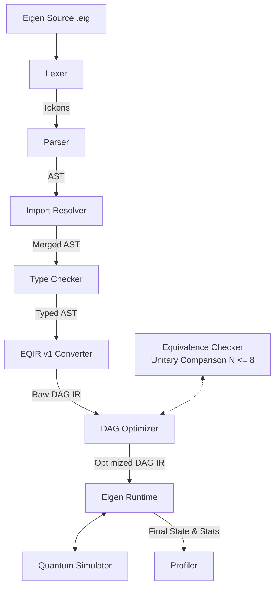

# Eigen Programming Language

Eigen is a domain-specific programming language for quantum computing, featuring a graph-based Intermediate Representation (EQIR v1), automatic circuit optimization, a state-vector simulator, and a formal circuit equivalence checker.

Designed to move beyond superficial quantum syntax, Eigen provides a complete computational framework for writing, optimizing, simulating, and validating quantum algorithms on classical hardware.



## Key Features

- **Modular Syntax**: Versioning headers (`eigen 1.0`), module namespaces (`module quantum.bell`), and imports (`import quantum.bell`).
- **Strict Typing**: A static type checker verifying bounds for `qubit`, `cbit`, `int`, and `float` variables.
- **Graph-Based Intermediate Representation (EQIR v1)**: Quantum circuits are represented as Directed Acyclic Graphs (DAGs) of operations, capturing topological dependencies along qubit wires.
- **Topological Runtime**: The Eigen Runtime executes instructions in topological order, avoiding artificial ordering constraints.
- **State-Vector Simulator**: Pure Python complex-number quantum simulator supporting unitary gates (H, X, Y, Z, S, T), rotation gates (RX, RY, RZ), multi-qubit gates (CNOT, CZ, SWAP), and probabilistic wavefunction collapse.
- **Circuit Optimizer**: Graph-level optimizations including redundant gate cancellation (e.g. consecutive Hadamards) and rotation merging (consecutive rotations about the same axis).
- **Formal Verification**: Mathematically checks whether two circuits are equivalent up to a global phase (\(U_1 = e^{i\theta} U_2\)) using exact unitary matrix comparison (restricted to \(N \le 8\) qubits).
- **Standard Library**: Built-in modules including Bell state, GHZ state, Deutsch algorithm oracles, and Grover diffusers.

## Getting Started

### Installation

Eigen requires **Python 3.10** or higher. There are no external dependencies, making it 100% portable.

Clone the repository:
```bash
git clone https://github.com/Eigenresearch/Eigen.git
cd Eigen
```

### Running Tests
Verify the installation by running the test suite:
```bash
python -m unittest discover -s tests
```

### Running an Example
Execute the Bell State creation program with tracing enabled to see step-by-step state amplitudes:
```bash
python src/main.py run examples/bell.eig --trace
```

### Comparing Circuit Equivalence
Check if an unoptimized circuit is equivalent to its optimized target:
```bash
python src/main.py verify-equiv examples/opt_demo.eig examples/opt_demo_target.eig --optimize
```

---

## Example Program: Bell State (`examples/bell.eig`)

```eigen
eigen 1.0
import quantum.bell

qubit q0
qubit q1

# Create Bell state |Phi+> = 1/sqrt(2) (|00> + |11>)
bell(q0, q1)

trace

cbit c0
cbit c1

measure q0 -> c0
measure q1 -> c1

print c0
print c1

# Bell state measurements are perfectly correlated
assert c0 == c1
```

---

## Roadmap

- **Phase 1 (Current)**: High-level compiler frontend, DAG-based EQIR v1 representation, state-vector simulation, exact unitary equivalence verification (\(N \le 8\)), and basic optimizations.
- **Phase 2**: Symbolic circuit equivalence checking for \(N > 8\) qubits, intermediate code generation, exporting to QASM/Qiskit formats, and advanced graph rewrite rules.
- **Phase 3**: Web-based IDE and visual compiler pipeline explorer, showing AST, EQIR, and state amplitude circles.

## Contributing

We welcome contributions! Please see our [Contributing Guide](CONTRIBUTING.md) and [Code of Conduct](CODE_OF_CONDUCT.md).

## License

Eigen is released under the [MIT License](LICENSE).
