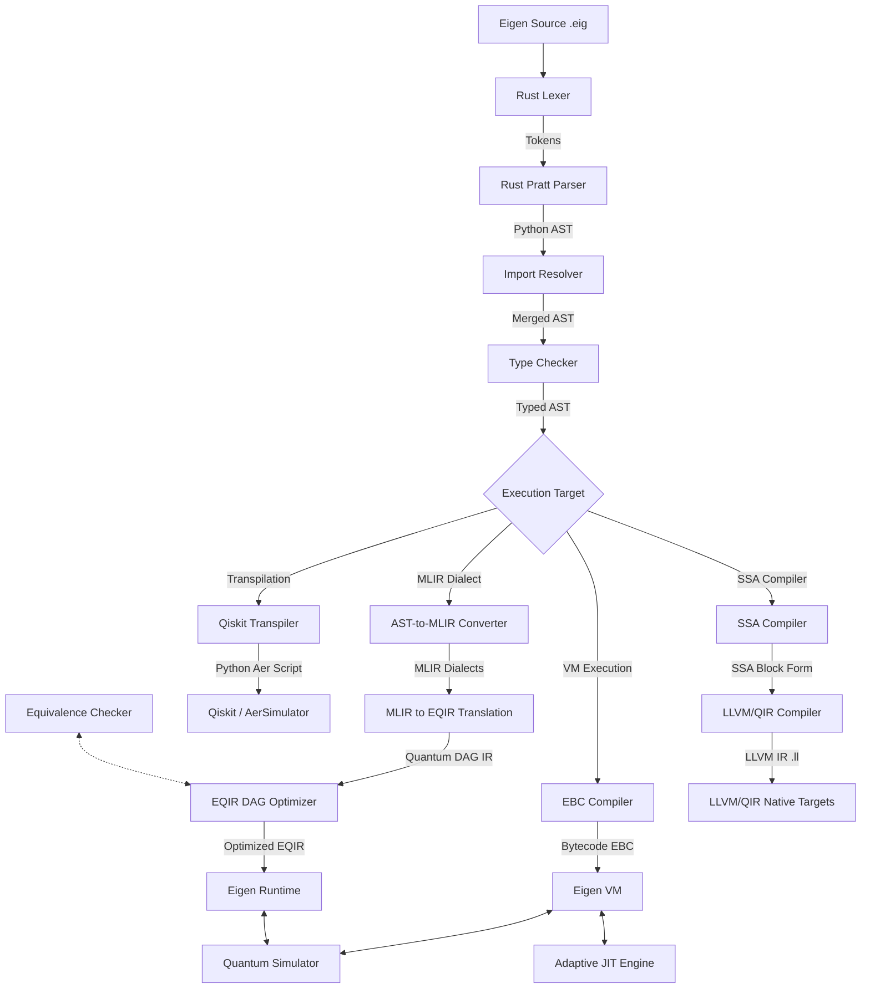

# Eigen Programming Language — Release 2.4 «Mone»

[](https://github.com/Eigenresearch/Eigen/actions)
[](https://github.com/Eigenresearch/Eigen)
[](LICENSE)
[](pyproject.toml)

> **«Faster. Harder. Less Python.»** — Release 2.4 "Mone" brings a completely decoupled, high-performance compilation and execution pipeline that eliminates Python overhead from critical execution paths, introduces a zero-copy native Rust frontend, implements a Salsa-inspired incremental compiler query database, and enables standalone LLVM/QIR native executable compilation.

---

## Table of Contents
1. [Why Eigen? (Competitive Paradigm Comparison)](#why-eigen-competitive-paradigm-comparison)
2. [Ecosystem Architecture & Compilation Pipeline](#ecosystem-architecture--compilation-pipeline)
3. [Language Feature Matrix](#language-feature-matrix)
4. [Helios CLI Manual & Developer Tooling](#helios-cli-manual--developer-tooling)
5. [Advanced Execution & Simulation Engines](#advanced-execution--simulation-engines)
6. [Formal Verification & ZX-Calculus Engine](#formal-verification--zx-calculus-engine)
7. [Native Rust Extension & Standalone Decoupling](#native-rust-extension--standalone-decoupling)
8. [Incremental Cache & SSA LLVM Target](#incremental-cache--ssa-llvm-target)
9. [Installation & Quick Start](#installation--quick-start)
10. [Example Codebases](#example-codebases)
11. [Release 2.4.0 Roadmap Status](#release-240-roadmap-status)

---

## Why Eigen? (Competitive Paradigm Comparison)

Quantum computing developer tools are historically split into host-language SDKs (like Qiskit or Pennylane) and low-level hardware representation formats (like OpenQASM). Eigen is designed as a standalone, domain-specific, hybrid classical-quantum language that offers native runtime guarantees.

* **Unlike Qiskit**: Qiskit is a Python library, meaning type checking, syntax validation, and circuit optimization happen inside Python's runtime memory space. Eigen is a compiled language, enabling structured, static type verification of quantum assets, modular namespaces, and compilation to target EBC bytecode files or LLVM IR code before execution.
* **Unlike OpenQASM 3.0**: OpenQASM 3.0 targets low-level hardware control with basic classical variables. Eigen supports a rich classical runtime including recursion, user-defined structures (`struct`), associative maps, dynamic arrays, and structured try-catch exception propagation.
* **Unlike Silq**: Silq uses an AST-based type safety compiler to track uncomputation. Eigen focuses on optimization at the Intermediate Representation (IR) level via Control Flow Graphs (CFG), Single Static Assignment (SSA) forms, Multi-Level Intermediate Representation (MLIR) dialects, and Directed Acyclic Graph (EQIR) gate dependency analysis.
* **Unlike Q#**: Q# relies on a heavy Microsoft compiler and .NET/LLVM execution stack. Eigen is lightweight and portable, compiling down to compact stack bytecode executed via a portable VM with an adaptive JIT engine or native Rust library.

---

## Ecosystem Architecture & Compilation Pipeline

The pipeline below details the conversion of an Eigen source file into optimized quantum states or hardware-compatible instruction streams:



---

## Language Feature Matrix

The table below provides a capability comparison between Eigen and other primary quantum development architectures:

| Feature / Capability | Eigen 2.4 — Mone | Qiskit (Python SDK) | OpenQASM 3.0 | Silq | Q# |
| :--- | :--- | :--- | :--- | :--- | :--- |
| **Execution Model** | VM (EBC) / Native Rust FFI / LLVM / QIR AOT | Host Python Interpreter | Hardware / AST | Compiled Native | VM / LLVM |
| **Classical State** | Full (Recursion, Exceptions, Structs, Maps, Dynamic Arrays) | Limited (Host Python environment) | Static / Limited | Limited (No exceptions/maps) | Dynamic / Limited |
| **Simulators** | State-Vector, Sparse (sparsity-scaling), MPS Tensor Network | Aer Simulator | Simulator-dependent | Wavefunction | Sparse / State-Vector |
| **VM Trace Engine** | Yes (Trace JIT v2, Loop-Invariant Code Motion, specialization) | No | No | No | No |
| **IR Architecture** | AST &rarr; MLIR &rarr; EQIR DAG &rarr; SSA | DAGCircuit | AST / flat gates | AST | QIR (LLVM) |
| **Verification Engine** | Unitary Equivalence & ZX-Calculus reduction | Equivalence library | None | Safe uncomputation | None |
| **Tooling & LSP** | Interactive Debugger & JSON-RPC LSP Server | IDE extensions | Syntax highlighting | VS Code Extension | VS Code Extension |
| **Package Manager** | Local/Remote Package Manager with `eigen.lock` verification | pip (Python) | None | None | dotnet/nuget |
| **Exporters** | IBM QASM, IonQ, AWS Braket, Azure QIR | Qiskit-specific | Export-dependent | None | QIR / QASM |

---

## Helios CLI Manual & Developer Tooling

The unified `eigen` command line utility exposes all compilation, optimization, simulation, debugging, packaging, and analysis features.

### Command Reference

* **`eigen run <file.eig>`**: Compiles and executes an Eigen program.
  - `--trace`: Enable trace prints showing step-by-step state vector changes and register values.
  - `--backend <target>`: Export and run on target backend (e.g. `qiskit`, `qasm`, `braket`).
  - `--gpu <platform>`: Select GPU acceleration platform (`auto` for auto-detect, `cuda`, `rocm`, `metal`, `none`).
  - `--aot`: Direct JIT compilation and native execution of classical/quantum code.
* **`eigen build <file.eig>`**: Compiles Eigen packages into EBC bytecode or LLVM files.
  - `--llvm`: Compiles SSA blocks directly into LLVM Intermediate Representation (`.ll`).
  - `--qir`: Generates QIR-compliant LLVM IR with opaque pointers.
  - `--aot`: Generates native standalone machine binaries (`.exe` on Windows).
  - `--opt-level <O0/O1/O2/O3>`: Set LLVM compiler optimization levels (default: `O2`).
  - `--lto`: Apply Link-Time Optimization during compilation (native GCC/Clang targets).
  - `--strip`: Strip symbols from the compiled binary to minimize size.
  - `--explain-cache`: Query status explaining incremental compilation steps and cache validity.
* **`eigen exec <file.ebc>`**: Executes precompiled EBC bytecode files directly in the VM environment.
* **`eigen verify-equiv <file1.eig> <file2.eig>`**: Checks formal equivalence of two quantum circuits.
  - `--method <unitary|zx>`: Selects verification method. `unitary` checks exact unitary matrix congruence; `zx` applies graph reduction simplifications.
* **`eigen verify <file.eig>`**: Scans code correctness, syntax compliance, and semantic soundness, reporting warnings and errors.
* **`eigen init <project-name>`**: Bootstraps a standard package layout with a template `eigen.toml` manifest file.
* **`eigen install`**: Downloads, installs, and locks package dependencies specified in `eigen.toml` to `eigen.lock`.
* **`eigen add <dependency>`**: Adds a dependency to the current manifest configuration.
* **`eigen search <query>`**: Queries remote registry indexes for matching modules.
* **`eigen fmt <file.eig>`**: Enforces style guides and auto-formats the source code.
* **`eigen doc`**: Parses source code comments and prints API references or generates HTML/Markdown documentation.
* **`eigen test`**: Recursively discovers and executes project unit tests.
* **`eigen bench`**: Executes execution benchmarks and reports performance charts.
  - `--frontend`: Profile and compare the performance of the Python parser vs. the zero-copy Rust parser.
* **`eigen profile <file.eig>`**: Profiles compiler passes, JIT tracing, VM runtime, and simulation memory.
* **`eigen audit`**: Audits packages against target backend capabilities.
  - `--strict`: In strict mode, compilation halts with code 1 if the target backend lacks support for any language constructs.
* **`eigen doctor`**: Scans health metrics of local toolchains, Python/Rust configurations, and compiler sanity.
* **`eigen lsp`**: Starts a JSON-RPC Language Server Protocol (LSP) daemon for IDE integration.

---

## Advanced Execution & Simulation Engines

Eigen features three specialized quantum simulation models to handle different circuit structures:

1. **State-Vector Simulator**: A contiguous double-precision state vector simulator. Suitable for general circuits up to $\approx 20$ qubits.
2. **Sparse Simulator**: A mathematically exact simulator using sparse-matrix representations. Scales efficiently with sparsity rather than a fixed qubit size; ideal for low-weight or sparse-gate operations on up to 50+ qubits.
3. **MPS (Matrix Product State) Tensor Network**: Simulates low-entanglement circuits up to 100+ qubits by decomposing the state vector using Singular Value Decomposition (SVD) and truncation dimensions.
   - Entanglement entropy tracking.
   - Cumulative truncation error logging.
4. **GPU Engine 2.0**: Auto-detects and accelerates state operations using GPU acceleration (via CUDA, ROCm, or Metal depending on hardware).

### Trace-Based Adaptive VM JIT v2

The VM contains a trace JIT engine. During bytecode loop execution, the JIT monitors basic blocks for high frequency execution (hotspots). Once a hotspot threshold is crossed, the JIT:
1. **Loop-Invariant Code Motion (LICM):** Analyzes the instructions inside hot traces and hoists any expressions producing invariant values outside the loop body to avoid redundant operations.
2. **Constant Folding:** Collapses known constant sub-expressions on-the-fly inside compiled traces.
3. **Trace Specialization:** Emits specialized execution sequences with inserted type and shape guards (e.g. tracking vector sizes or scalar classifications).
4. **Deoptimization Paths:** If any type or shape guard fails at runtime, the JIT gracefully exits the native execution segment and jumps to fallback classical VM paths without state corruption.

This architecture delivers a **2x-5x execution speedup** on general hybrid classical-quantum tasks.

---

## Formal Verification & ZX-Calculus Engine

The formal equivalence checker (`eigen verify-equiv`) evaluates whether two quantum circuits represent the same mathematical operator up to a global phase:

1. **Fast-Reject Layer:** For circuits containing a small number of qubits ($N \le 8$), the checker constructs full unitary matrices and verifies matrix equivalence directly.
2. **ZX-Calculus Graph Reduction:** For larger circuits, the compiler translates gate sequences into ZX-graphs consisting of:
   - **Z-spiders (green nodes):** Representing phase shifts and diagonal operators.
   - **X-spiders (red nodes):** Representing bit flips and off-diagonal transformations.
   - **H-boxes (hadamard gates):** Acting as basis converters.
   
   The engine then applies simplification theorems iteratively:
   - **Spider Fusion:** Merges adjacent spiders of the same color.
   - **Identity Removal:** Deletes phase shifts equal to zero.
   - **Local Complementation:** Simplifies Clifford subgraphs by complementing neighbor connections.
   - **Pivoting:** Eliminates connected pairs of spiders with non-Clifford phases.
   - **Bialgebra and Hopf Rules:** Clears redundant connections and self-loops.

   If the simplified graphs match identically, the circuits are proven formally equivalent. If the graph reduction is inconclusive, the system reports `Indeterminate` rather than returning a false positive.

---

## Troubleshooting & FAQ

### 1. Windows MSVC Linker Error LNK1107 or LNK1158
* **Cause:** Happens during `--aot` binary compilation when `link.exe` cannot find compiler paths or has mismatched flags (e.g. `/DEBUG:NONE`).
* **Fix:** Ensure you run compilation from the "Developer PowerShell for VS" or that MSVC `cl.exe`/`link.exe` paths are in your system `PATH`. The compiler automatically replaces `/DEBUG:NONE` with `/RELEASE` to resolve MSVC constraints.

### 2. PyO3 Runtime GIL Access Violations (0xC0000005)
* **Cause:** Linking a precompiled static library containing CPython hooks into a standalone executable.
* **Fix:** Build `eigen_native` with the `--no-default-features` flag:
  ```bash
  cd native/rust
  cargo build --release --no-default-features
  ```
  This removes all `pyo3` dependencies and yields a pure-native static library.

### 3. Sparse Simulator Hangs on Large Superpositions
* **Cause:** Running highly entangled states (e.g., $H$ gate applied to 20+ qubits simultaneously) inside the sparse simulator. The sparse simulator maps states with non-zero amplitudes; superposition-heavy workloads grow exponentially and should be simulated using the dense backend.
* **Fix:** Use the auto-routing selector. The system automatically switches backends based on density thresholds.

### 4. ValueError: path is on mount 'D:', start on mount 'C:'
* **Cause:** Running tests or building packages across different Windows drives when using relative path resolutions in the cache DB.
* **Fix:** The Salsa query engine automatically catches mount exceptions and falls back to absolute path key mappings.

---

## Native Rust Extension & Standalone Decoupling

Eigen includes a highly optimized Rust native layer (`eigen_native`) integrated via PyO3 for Python environments, which can also be compiled completely free of CPython dependency:

- **Zero CPython Dependency:** Compiling the native module with:
  ```bash
  cargo build --release --no-default-features
  ```
  Removes all Python runtime checks, PyO3 bindings, and GIL references. This yields a static library that can be linked with standalone executables compiled via LLVM, preventing runtime access violations.
- **Zero-Copy Parser:** Written in recursive-descent/Pratt parser format, it slices tokens directly from byte streams without string allocations and constructs standard mutable Python AST structures.
- **SIMD Gates & Rayon Parallelism:** Core gates (H, X, Y, Z, CNOT) are accelerated with AVX2/AVX512 runtime detection and partitioned threads using Rayon for sizes above $16,384$ amplitudes.

---

## Incremental Cache & SSA LLVM Target

- **Incremental Compiler Cache:** Implements a query-based (Salsa-inspired) compilation database that hashes file contents (SHA-256) recursively. If a file and its dependencies are unchanged, AST parsing, Type Checking, and EQIR generation steps are bypassed and loaded directly from cache.
- **LLVM / QIR Target:** Compiles SSA basic blocks into LLVM IR (`.ll`). This generates standard LLVM files referencing standard Quantum Intermediate Representation (QIR) bindings.

---

## Installation & Quick Start

### 1. Prerequisites
Ensure you have Python 3.10+ and a Rust compiler toolchain (to build native modules) installed.

### 2. Local Setup
Clone the repository and install the development version using `uv` or `pip`:
```bash
git clone https://github.com/Eigenresearch/Eigen.git
cd Eigen
pip install -e .
```
To compile the native Rust module in development mode:
```bash
cd native/rust
maturin develop
```

### 3. Verification & Smoke Test
Run the test suite to verify the installation:
```bash
eigen test
```

### 4. Direct Execution
Execute a hybrid quantum example on the VM with trace logging enabled:
```bash
eigen run examples/bell.eig --trace
```

### 5. Compiling to LLVM IR & QIR
Compile your code to standard LLVM IR / QIR:
```bash
eigen build examples/bell.eig --llvm --qir
```

---

## Performance Benchmarks

### VM vs. AOT Execution Time

Standalone native executables compiled with `eigen build <file> --aot` bypass the VM loop completely. Fixed startup overhead (~9 ms under Windows) is amortized for longer-running execution loops:

| Program | VM (ms) | AOT (ms) | Speedup |
|---|---|---|---|
| fib(22) classical | 411.89 ms | 22.84 ms | **18.04x** |
| Bell pair (500 shots) | 125.52 ms | 9.26 ms | **13.55x** |
| Grover 2-qubit (500 iter) | 138.50 ms | 10.65 ms | **13.01x** |
| factorial(12) x 10000 classical | 917.54 ms | 20.80 ms | **44.10x** |

### Parser Benchmarks (Python vs. Rust)

Comparing file parse speeds for various codebases (1k, 10k, 100k lines of code):

| Code Size (Lines) | Python Parser (ms) | Rust Parser (ms) | Speedup |
|---|---|---|---|
| 1k | 21.29 ms | 2.21 ms | **9.7x** |
| 10k | 181.56 ms | 29.20 ms | **6.2x** |
| 100k | 2010.79 ms | 479.98 ms | **4.2x** |

---

## Example Codebases

### Quantum Fourier Transform (`examples/qft.eig`)
```eigen
eigen 2.4
module quantum.qft

# Apply 3-qubit QFT
qubit q0
qubit q1
qubit q2

H q0
RZ q0, 1.57079632679 # pi/2
CNOT q1, q0
RZ q0, 0.78539816339 # pi/4
CNOT q2, q0

H q1
RZ q1, 1.57079632679 # pi/2
CNOT q2, q1

H q2
SWAP q0, q2
```

### Grover's Algorithm (`examples/grover.eig`)
```eigen
eigen 2.4
module quantum.grover

# Grover Search for state |11>
qubit q0
qubit q1
cbit c0
cbit c1

# Initialization
H q0
H q1

# Oracle (flips phase of |11>)
H q1
CNOT q0, q1
H q1

# Diffusion (H -> X -> CZ -> X -> H)
H q0
H q1
X q0
X q1
H q1
CNOT q0, q1
H q1
X q0
X q1
H q0
H q1

measure q0 -> c0
measure q1 -> c1
```

---

## Release 2.4.0 Roadmap Status

* **[x] Phase M1 (Rust Frontend & Decoupled AOT Compiler):** Pratt parser, FFI decoupling, trace support.
* **[x] Phase M2 (Native Kernels v2 & SIMD):** Rayon parallel loops, sparse optimization.
* **[x] Phase M3 (Incremental Compilation 2.0 & JIT v2):** Salsa-query caching, guards, LICM.
* **[x] Phase M4 (AOT Expansion & QIR Integration):** O2/O3, LTO, strip, MSVC link.exe fixes, QFT binary execution.
* **[ ] Phase M5 (Generics & Routing):** Monomorphization, SABRE routing, circuit visualization.
* **[ ] Phase M6 (VS Code Extension & LSP):** LSP inline diagnostics and auto-fixes.
* **[ ] Phase M7 (Doc website & Release):** Mike versioning deployment.

---

## License
Eigen is released under the [MIT License](LICENSE).
