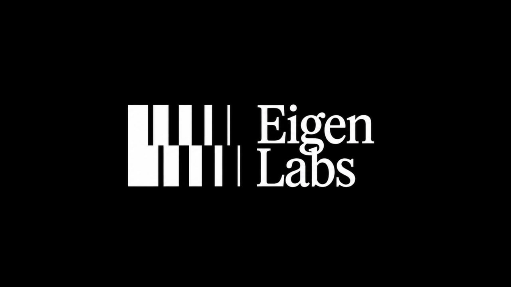
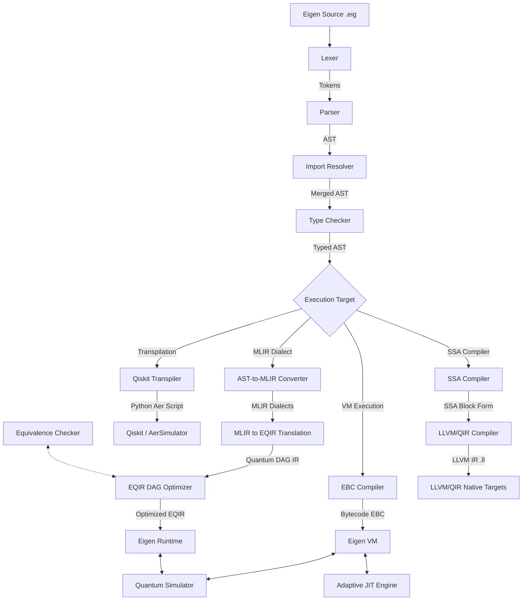

# Eigen Programming Language



Eigen is a domain-specific, hybrid classical-quantum programming language designed to bridge the gap between high-level classical programming abstractions and physical quantum computation. Rather than acting as a simple quantum gate-assembly wrapper, Eigen provides a unified computational model. It combines a complete classical control runtime (supporting recursion, structural types, dynamic collections, and structured exceptions) with native quantum simulation, hardware-constrained routing, formal circuit verification, and an optimized execution pipeline.

---

## Table of Contents
1. [Why Eigen? (Competitive Paradigm Comparison)](#why-eigen-competitive-paradigm-comparison)
2. [Ecosystem Architecture & Compilation Pipeline](#ecosystem-architecture--compilation-pipeline)
3. [Language Feature Matrix](#language-feature-matrix)
4. [Helios CLI Manual & Developer Tooling](#helios-cli-manual--developer-tooling)
5. [Advanced Execution & Simulation Engines](#advanced-execution--simulation-engines)
6. [Formal Verification & ZX-Calculus Engine](#formal-verification--zx-calculus-engine)
7. [Native Rust Extension & Native Runtime Layer](#native-rust-extension--native-runtime-layer)
8. [Incremental Cache & SSA LLVM Target](#incremental-cache--ssa-llvm-target)
9. [Installation & Quick Start](#installation--quick-start)
10. [Example Codebases](#example-codebases)
11. [Detailed Language Specification Reference](#detailed-language-specification-reference)

---

## Why Eigen? (Competitive Paradigm Comparison)

Quantum computing developer tools are historically split into host-language SDKs (like Qiskit or Pennylane) and low-level hardware representation formats (like OpenQASM). Eigen is designed as a standalone, domain-specific, hybrid classical-quantum language that offers native runtime guarantees.

* **Unlike Qiskit**: Qiskit is a Python library, meaning type checking, syntax validation, and circuit optimization happen inside Python's runtime memory space. Eigen is a compiled language, enabling structured, static type verification of quantum assets, modular namespaces, and compilation to target EBC bytecode files or LLVM IR code before execution.
* **Unlike OpenQASM 3.0**: OpenQASM 3.0 targets low-level hardware control with basic classical variables. Eigen supports a rich classical runtime including recursion, user-defined structures (`struct`), associative maps, dynamic arrays, and structured try-catch exception propagation.
* **Unlike Silq**: Silq uses an AST-based type safety compiler to track uncomputation. Eigen focuses on optimization at the Intermediate Representation (IR) level via Control Flow Graphs (CFG), Single Static Assignment (SSA) forms, Multi-Level Intermediate Representation (MLIR) dialects, and Directed Acyclic Graph (EQIR) gate dependency analysis.
* **Unlike Q#**: Q# relies on a heavy Microsoft compiler and .NET/LLVM execution stack. Eigen is lightweight and portable, compiling down to compact stack bytecode executed via a portable VM with an adaptive JIT engine or native Rust library.

---

## Ecosystem Architecture & Compilation Pipeline

The pipeline below details the conversion of an Eigen source file into optimized quantum states or hardware-compatible instruction streams:



---

## Language Feature Matrix

The table below provides a capability comparison between Eigen and other primary quantum development architectures:

| Feature / Capability | Eigen 2.3 — Helios | Qiskit (Python SDK) | OpenQASM 3.0 | Silq | Q# |
| :--- | :--- | :--- | :--- | :--- | :--- |
| **Execution Model** | VM (EBC Bytecode) / Native Rust FFI / LLVM | Host Python Interpreter | Hardware / AST | Compiled Native | VM / LLVM |
| **Classical State** | Full (Recursion, Exceptions, Structs, Maps, Dynamic Arrays) | Limited (Host Python environment) | Static / Limited | Limited (No exceptions/maps) | Dynamic / Limited |
| **Simulators** | State-Vector, Sparse (sparsity-scaling), MPS Tensor Network | Aer Simulator | Simulator-dependent | Wavefunction | Sparse / State-Vector |
| **VM Trace Engine** | Yes (Trace-Based Adaptive Execution, 2x-5x speedup) | No | No | No | No |
| **IR Architecture** | AST &rarr; MLIR &rarr; EQIR DAG &rarr; SSA | DAGCircuit | AST / flat gates | AST | QIR (LLVM) |
| **Verification Engine** | Unitary Equivalence & ZX-Calculus reduction | Equivalence library | None | Safe uncomputation | None |
| **Tooling & LSP** | Interactive Debugger & JSON-RPC LSP Server | IDE extensions | Syntax highlighting | VS Code Extension | VS Code Extension |
| **Package Manager** | Local/Remote Package Manager with `eigen.lock` verification | pip (Python) | None | None | dotnet/nuget |
| **Exporters** | IBM QASM, IonQ, AWS Braket, Azure QIR | Qiskit-specific | Export-dependent | None | QIR / QASM |

---

## Helios CLI Manual & Developer Tooling

The unified `eigen` command line utility exposes all compilation, optimization, simulation, debugging, packaging, and analysis features.

### Command Reference

* **`eigen run <file.eig>`**: Compiles and executes an Eigen program.
  - `--trace`: Enable trace prints showing step-by-step state vector changes and register values.
  - `--backend <target>`: Export and run on target backend (e.g. `qiskit`, `qasm`, `braket`).
  - `--gpu <platform>`: Select GPU acceleration platform (`auto` for auto-detect, `cuda`, `rocm`, `metal`, `none`).
* **`eigen build`**: Compiles Eigen packages into EBC bytecode or LLVM files.
  - `--llvm`: Compiles SSA blocks directly into LLVM Intermediate Representation (`.ll`).
* **`eigen exec <file.ebc>`**: Executes precompiled EBC bytecode files directly in the VM environment.
* **`eigen verify-equiv <file1.eig> <file2.eig>`**: Checks formal equivalence of two quantum circuits.
  - `--method <unitary|zx>`: Selects verification method. `unitary` checks exact unitary matrix congruence; `zx` applies graph reduction simplifications.
* **`eigen verify <file.eig>`**: Scans code correctness, syntax compliance, and semantic soundness, reporting warnings and errors.
* **`eigen init <project-name>`**: Bootstraps a standard package layout with a template `eigen.toml` manifest file.
* **`eigen install`**: Downloads, installs, and locks package dependencies specified in `eigen.toml` to `eigen.lock`.
* **`eigen add <dependency>`**: Adds a dependency to the current manifest configuration.
* **`eigen search <query>`**: Queries remote registry indexes for matching modules.
* **`eigen fmt <file.eig>`**: Enforces style guides and auto-formats the source code.
* **`eigen doc`**: Parses source code comments and prints API references or generates HTML/Markdown documentation.
* **`eigen test`**: Recursively discovers and executes project unit tests.
* **`eigen bench`**: Executes execution benchmarks and reports performance charts.
* **`eigen profile <file.eig>`**: Profiles compiler passes, JIT tracing, VM runtime, and simulation memory.
* **`eigen audit`**: Audits packages against target backend capabilities.
  - `--strict`: In strict mode, compilation halts with code 1 if the target backend lacks support for any language constructs (e.g. structs on IBM QASM).
* **`eigen doctor`**: Scans health metrics of local toolchains, Python/Rust configurations, and compiler sanity.
* **`eigen lsp`**: Starts a JSON-RPC Language Server Protocol (LSP) daemon for IDE integration.

---

## Advanced Execution & Simulation Engines

Eigen features three specialized quantum simulation models to handle different circuit structures:

1. **State-Vector Simulator**: A contiguous double-precision state vector simulator. Suitable for general circuits up to $\approx 20$ qubits.
2. **Sparse Simulator**: A mathematically exact simulator using sparse-matrix representations. Scales efficiently with sparsity rather than a fixed qubit size; ideal for low-weight or sparse-gate operations on up to 50+ qubits.
3. **MPS (Matrix Product State) Tensor Network**: Simulates low-entanglement circuits up to 100+ qubits by decomposing the state vector using Singular Value Decomposition (SVD) and truncation dimensions.
   - Entanglement entropy tracking.
   - Cumulative truncation error logging.
4. **GPU Engine 2.0**: Auto-detects and accelerates state operations using GPU acceleration (via CUDA, ROCm, or Metal depending on hardware).

### Trace-Based Adaptive VM JIT
The VM contains a trace JIT engine. During bytecode loop execution, the tracer identifies repeating basic blocks, compiles them on-the-fly to optimized native bytecode paths, and caches them. This provides a 2x-5x execution speedup.

---

## Formal Verification & ZX-Calculus Engine

The equivalence checker (`eigen verify-equiv`) verifies circuit similarity:

1. **Fast-Reject Layer**: Builds and compares unitary matrices for small circuits to quickly catch discrepancies.
2. **ZX-Calculus Graph Reduction**: Converts circuits into ZX graphs representing Z-spiders, X-spiders, and H-boxes. It applies simplification theorems:
   - Spider fusion.
   - Local complementation.
   - Pivoting.
   - Bialgebra and Hopf rules.
   - Phase gadget fusion.

If the simplified ZX graphs match, equivalence is formally proven. This is ideal for validating large Clifford+T circuits.

---

## Native Rust Extension & Native Runtime Layer

To eliminate Python execution overhead, Eigen supports a compiled Rust extension library (`eigen_native` via PyO3):

- **Native VM Loop**: Executes the EBC instruction set directly in a fast Rust loop (`execute_bytecode_native`).
- **Native Simulators**: Offloads gate multiplication kernels (H, X, Y, Z, CNOT, CZ) to Rust.
- **Fast Shortest-Path Router**: Accelerates topological swaps and routing on complex hardware coupling maps.
- **Fast ZX Simplifier**: Performs graph operations directly in native memory.

---

## Incremental Cache & SSA LLVM Target

Eigen 2.3 optimizes compilation speed and target adaptability:

- **Incremental Cache**: Hashes AST, SSA, EQIR, ZX, and EBC files. If a file is unmodified, the compiler loads the cache directly, avoiding recompilation.
- **LLVM / QIR Target**: Compiles SSA basic blocks into LLVM IR (`.ll`). This generates standard LLVM files referencing standard Quantum Intermediate Representation (QIR) bindings.

---

## Installation & Quick Start

### 1. Prerequisites
Ensure you have Python 3.10+ and a Rust toolchain (optional, for native modules) installed.

### 2. Local Setup
Clone the repository and install the development version:
```bash
git clone https://github.com/Eigenresearch/Eigen.git
cd Eigen
pip install -e .
```

### 3. Verification & Smoke Test
Run the test suite to verify the installation:
```bash
eigen test
```

### 4. Direct Execution
Execute a hybrid quantum example on the VM with trace logging enabled:
```bash
eigen run examples/bell.eig --trace
```

### 5. Compiling to LLVM IR
Compile your code to standard LLVM IR / QIR:
```bash
eigen build examples/bell.eig --llvm
```

---

## Example Codebases

### Bell State Execution (`examples/bell.eig`)
```eigen
eigen 2.3
module quantum.bell

qubit q0
qubit q1
cbit c0
cbit c1

H q0
CNOT q0, q1

measure q0 -> c0
measure q1 -> c1

print c0
print c1
assert c0 == c1
```

### Hybrid Quantum-Classical Task Scheduler
```eigen
eigen 2.3

func run_heavy_sim(id: int) -> int {
    # Perform simulation steps
    return id * 10
}

parallel {
    task run_heavy_sim(1)
    task run_heavy_sim(2)
}
```

---

## Detailed Language Specification Reference

For a complete guide to grammar, language keywords, static type system rules, exceptions, standard library stubs, and MLIR configurations, refer to the [Language Specification](LANGUAGE.md).
