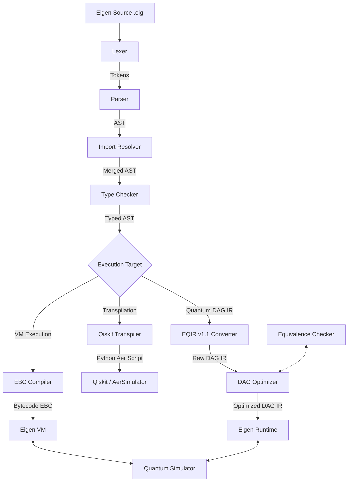

# Eigen Programming Language

Eigen is a domain-specific, hybrid classical-quantum programming language. It combines classical control flow, data structures, and exception handling with quantum operations, automatic DAG circuit optimization, and formal circuit equivalence checking.

Designed to move beyond superficial quantum syntax, Eigen provides a complete computational framework for writing, optimizing, simulating, and validating quantum algorithms on classical hardware.

---

## Why Eigen?

Eigen is a hybrid classical-quantum programming language. It combines:
- **Classical programming**: Recursive functions, structures, arrays, maps, and try-catch exceptions.
- **Quantum programming**: Qubit allocation, built-in gates, rotation gates, and measurements.
- **Formal circuit verification**: Mathematically checks whether two circuits are equivalent up to a global phase (\(U_1 = e^{i\theta} U_2\)) using exact unitary matrix comparison.
- **Graph-based optimization**: Redundant gate cancellation and rotation merging on Directed Acyclic Graph (DAG) representations.
- **Exact equivalence checking**: Graph-level equivalence verification inside a single, unified language.

---

## Architecture Overview

Below is the compilation-to-execution pipeline of the Eigen ecosystem:



---

## Runtime Guarantees

Eigen Runtime and VM provide full language support. Every language construct—including recursive functions, loops, structures, arrays, maps, and exception catch blocks—is executed natively by the Eigen VM. Classical execution is considered the source of truth, whereas backend exporters (like the Qiskit backend) are optional compatibility targets.

---

## Backend Compatibility Matrix

| Feature / Capability | Eigen Runtime / VM | Qiskit Transpiler |
| -------------------- | ------------------ | ----------------- |
| Quantum Gates        | Full               | Full              |
| Measurements         | Full               | Full              |
| Arrays               | Full               | Partial (Static)  |
| Structs              | Full               | None              |
| Maps                 | Full               | None              |
| Recursion            | Full               | None              |
| Exceptions           | Full               | None              |
| Loops                | Full               | None              |
| Imports              | Full               | Partial           |

---

## Key Features

- **Modular Syntax**: Versioning headers (`eigen 1.0`), module namespaces (`module quantum.bell`), and imports (`import quantum.bell`).
- **Strict Typing**: A static type checker verifying bounds for `qubit`, `cbit`, `int`, and `float` variables.
- **Graph-Based Intermediate Representation (EQIR v1.1)**: Quantum circuits are represented as Directed Acyclic Graphs (DAGs) of operations, capturing topological dependencies along qubit wires.
- **Topological Runtime**: The Eigen Runtime executes instructions in topological order, avoiding artificial ordering constraints.
- **State-Vector Simulator**: Pure Python complex-number quantum simulator supporting unitary gates (H, X, Y, Z, S, T), rotation gates (RX, RY, RZ), multi-qubit gates (CNOT, CZ, SWAP), and probabilistic wavefunction collapse.
- **Circuit Optimizer**: Graph-level optimizations including redundant gate cancellation (e.g. consecutive Hadamards) and rotation merging (consecutive rotations about the same axis).
- **Formal Verification**: Mathematically checks whether two circuits are equivalent up to a global phase (\(U_1 = e^{i\theta} U_2\)) using exact unitary matrix comparison (restricted to \(N \le 8\) qubits).
- **Standard Library**: Built-in modules including Bell state, GHZ state, Deutsch algorithm oracles, and Grover diffusers.

---

## Getting Started

### Installation

Eigen requires **Python 3.10** or higher. There are no external dependencies, making it 100% portable.

Clone the repository:
```bash
git clone https://github.com/Eigenresearch/Eigen.git
cd Eigen
```

### Running Tests
Verify the installation by running the test suite (includes unit tests, conformance tests, and backend validation tests):
```bash
python -m unittest discover -s tests
```

### Running an Example on VM
Execute the Bell State creation program with tracing enabled to see step-by-step state amplitudes:
```bash
python src/main.py run examples/phase2_demo.eig --vm --trace
```

### Transpiling to Qiskit
Transpile an Eigen program to a Python Qiskit Aer script:
```bash
python src/main.py run examples/phase2_demo.eig --backend qiskit
```

---

## Example Program: Bell State (`examples/phase2_demo.eig`)

```eigen
eigen 1.0

# API Reference Demonstration: Person struct
struct Person {
    age: int,
    score: float
}

# Classical recursive factorial function
func factorial(n: int) -> int {
    if n == 0 {
        return 1
    }
    return n * factorial(n - 1)
}

# 1. Execute classical recursion
let fact5: int = factorial(5)
print fact5
assert fact5 == 120

# 2. Instantiate and mutate structure
let p: Person = Person { age: 30, score: 95.5 }
p.age = 31
let page: int = p.age
print page
assert page == 31

# 3. Create entangled quantum Bell state
qubit q0
qubit q1
cbit c0
cbit c1

H q0
CNOT q0, q1

# 4. Measure qubits and verify entanglement
measure q0 -> c0
measure q1 -> c1

print c0
print c1
assert c0 == c1
```
