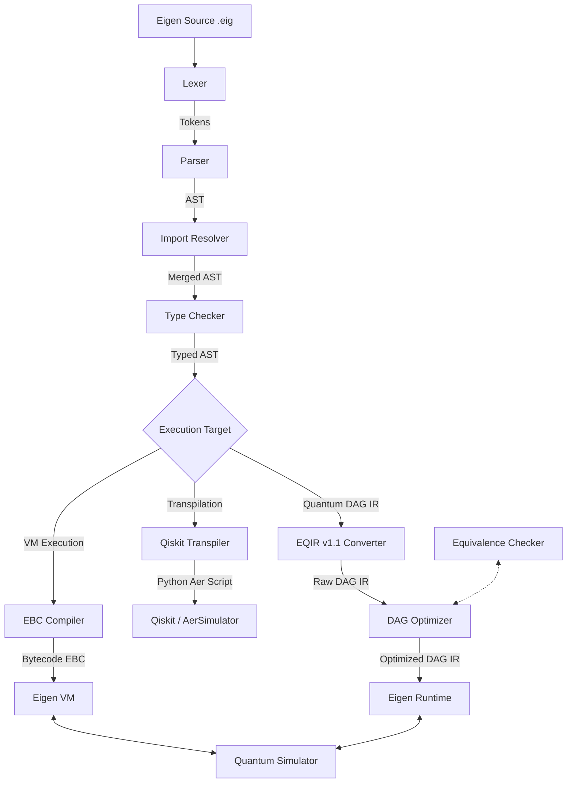

# Eigen Architecture Documentation

This document describes the compilation, optimization, and execution pipeline of the Eigen programming language framework.

## 1. System Pipeline Overview

Eigen translates high-level quantum and classical source code into either an optimized Intermediate Representation (EQIR v1.1) or stack-based bytecode (EBC), supporting both fast simulation and cross-platform transpilation.

---

## 2. Component Layout & Responsibilities

### 2.1 Lexer (`lexer.py`)
Performs lexical scanning, stripping comments, identifying numeric literals, operators, symbols, keywords, and preserving line and column markers.

### 2.2 Parser (`parser.py`)
Implements recursive descent parsing, handles operator precedence, and builds typed AST nodes representing the syntax grammar.

### 2.3 Import Resolver (`import_resolver.py`)
Resolves module namespaces to absolute file system locations, checking both local workspace paths and standard library modules (`stdlib/`).

### 2.4 Type Checker (`type_checker.py`)
Inspects variable bindings and declarations. Enforces static type boundaries and checks variable compatibility (e.g., `cbit` and `int`).

### 2.5 Diagnostic Engine (`diagnostics.py`)
Collects errors, warnings, and informational diagnostics, providing line/column locations for CLI outputs and IDE integrations.

### 2.6 Backend Capability Layer (`backend_capabilities.py`)
Defines targets' capability profiles and validates compatibility of AST nodes with target backends.

### 2.7 EBC Compiler & VM (`ebc_compiler.py`, `vm.py`)
Compiles AST nodes into Eigen Bytecode (EBC) and executes them step-by-step using a stack-based call frame, heap manager, and simulator connection.

### 2.8 EQIR v1.1 Converter & Optimizer (`ir_converter.py`, `optimizer.py`)
Converts AST to a Directed Acyclic Graph (DAG) representing wire dataflow, and optimizes the DAG by canceling self-inverse gates and merging rotation angles.

### 2.9 Equivalence Checker (`equivalence.py`)
Mathematically checks whether two EQIR circuits are equivalent up to a global phase (\(U_1 = e^{i\theta} U_2\)) using exact unitary matrix comparison.

### 2.10 State-Vector Simulator (`simulator.py`)
Executes quantum state manipulations, updates amplitude coordinates, collapses state spaces upon measurement, and applies noise channels.

---

## 3. Runtime Guarantees

The Eigen VM execution engine guarantees complete coverage of the language's capabilities. Features such as recursive function calling, heap collections, struct allocation, exception try-catch logic, and physical noise channels are guaranteed to execute natively on the state-vector simulator.

---

## 4. Backend Compatibility Matrix

| System Component | Eigen VM Target | topological Runtime | Qiskit Backend |
| --- | --- | --- | --- |
| Quantum Gates | `FULL` | `FULL` | `FULL` |
| Measurements | `FULL` | `FULL` | `FULL` |
| Noise Channels | `FULL` | `NONE` | `NONE` |
| Classical Structs | `FULL` | `NONE` | `NONE` |
| Recursion (Stack) | `FULL` | `NONE` | `NONE` |
| Exceptions (Catch) | `FULL` | `NONE` | `NONE` |
