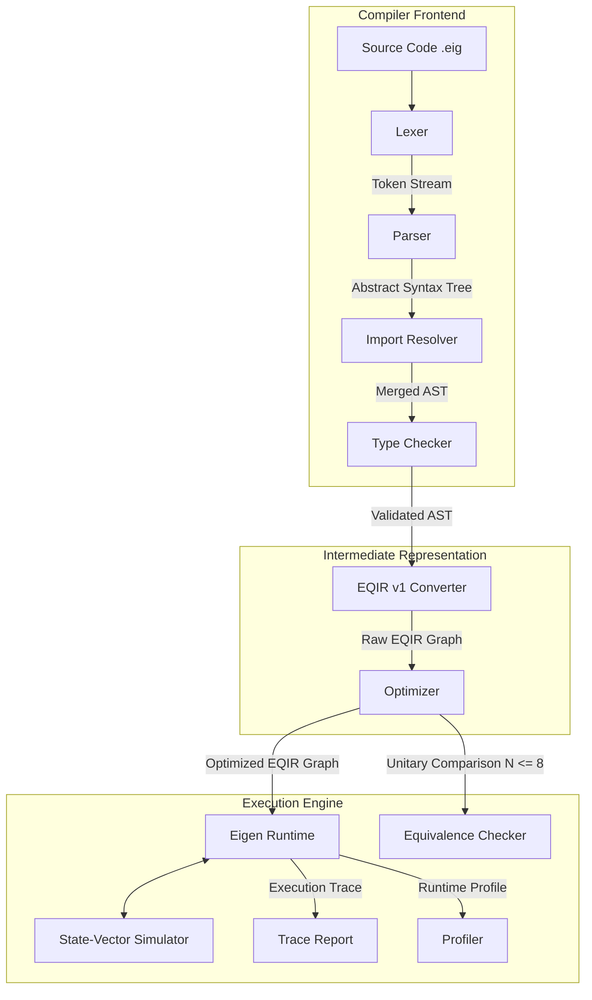

# Eigen Architecture Documentation

This document describes the compilation, optimization, and execution pipeline of the Eigen programming language framework.

## 1. System Pipeline Overview

Eigen translates high-level quantum source code into an optimized Intermediate Representation, which is subsequently simulated and profiled on classical hardware.

## 2. Component Layout & Responsibilities

### 2.1 Lexer (`lexer.py`)
- **Input**: Plain-text source code string.
- **Output**: Stream of typed `Token` objects.
- **Responsibility**: Performs lexical scanning, strips comments (both `#` and `//`), identifies numeric literals, built-in gates, keywords, and preserves line and column markers for error reporting.

### 2.2 Parser (`parser.py`)
- **Input**: Token stream from the Lexer.
- **Output**: Abstract Syntax Tree (AST) rooted at a `ProgramNode`.
- **Responsibility**: Implements recursive descent parsing, handles operator precedence for arithmetic expressions (using Pratt parsing concepts), and builds typed AST nodes representing the syntax grammar.

### 2.3 Import Resolver (`import_resolver.py`)
- **Input**: AST containing `ImportNode` references.
- **Output**: Merged AST containing all function declarations from imported modules.
- **Responsibility**: Resolves module namespaces to absolute file system locations, checking both local workspace paths and the standard library (`stdlib/`). Recursively parses modules to handle dependencies, preventing cyclic imports.

### 2.4 Type Checker (`type_checker.py`)
- **Input**: Merged AST from the Import Resolver.
- **Output**: Validated AST (or raises `TypeErrorException`).
- **Responsibility**: Inspects variable bindings and declarations. Enforces strict resource usage (e.g. quantum gates can only be applied to qubits, measurements must map from qubits to classical bits, and function call argument signatures must match parameters).

### 2.5 EQIR v1 Converter (`ir_converter.py`)
- **Input**: Validated AST.
- **Output**: **EQIR v1** Graph (Directed Acyclic Graph).
- **Responsibility**: Inlines all quantum subroutine (`qfunc`) calls by recursively generating nodes with mapped parameter names. Statically evaluates arithmetic constants (like `PI / 2`) and builds dataflow dependency edges.

### 2.6 Optimizer (`optimizer.py`)
- **Input**: Raw EQIR Graph.
- **Output**: Optimized EQIR Graph.
- **Responsibility**: Traverses the DAG to perform local circuit rewrites. Cancels consecutive self-inverse gates (like \(H \cdot H = I\)) and merges consecutive rotations about the same axis.

### 2.7 State-Vector Simulator (`simulator.py`)
- **Input**: Gate operations from the Runtime.
- **Output**: Complex amplitudes state vector updates.
- **Responsibility**: Allocates complex vector coordinates, applies \(2 \times 2\) and \(4 \times 4\) unitary matrices to represent gates, calculates measurement outcome probabilities, and simulates wavefunction collapse.

### 2.8 Eigen Runtime (`runtime.py`)
- **Input**: Optimized EQIR Graph.
- **Output**: Final execution log.
- **Responsibility**: Sorts the EQIR graph topologically to compute execution schedules. Executes statements sequentially, resolves dynamic branches (`if`), runs assertions, and formats detailed trace files.

### 2.9 Equivalence Checker (`equivalence.py`)
- **Input**: Two distinct EQIR Graphs.
- **Output**: Boolean equivalence state.
- **Responsibility**: Extracts active qubits, checks size constraints (\(N \le 8\)), constructs full unitary matrices for both graphs by running basis inputs, and checks if they are equivalent up to global phase.

### 2.10 Profiler (`profiler.py`)
- **Input**: EQIR Graph and execution timing data.
- **Output**: Profile statistics.
- **Responsibility**: Computes critical path lengths (circuit depth), gate counts, entangling gate counts, and tracks execution duration.
