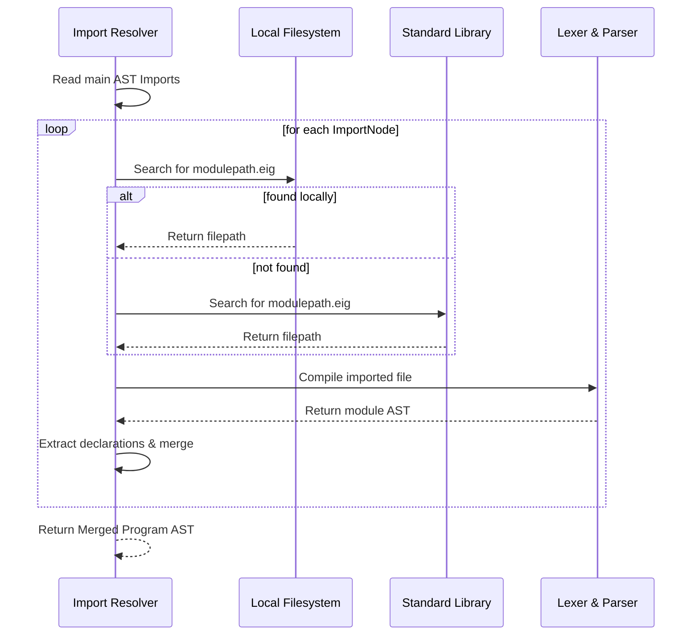

# Eigen Compiler Design

This document details the design of the compilation pipeline for the Eigen compiler frontend and bytecode target layers.

## 1. Lexical Analysis (`lexer.py`)

The Lexer is implemented as a character-by-character scanner. It scans the source string and generates a sequence of `Token` objects.

### Token Layout
Each `Token` holds:
- **`type`**: A `TokenType` enum value identifying its grammatical role.
- **`value`**: The raw string slice matching the token.
- **`line`**: The 1-based line number of the match.
- **`column`**: The 1-based column offset within the line.

### Scanning Algorithm
1. **Whitespace & Comments**: Skips whitespace (` `, `\t`, `\r`, `\n`) and updates coordinates. Comments starting with `#` or `//` skip characters until a newline.
2. **Numeric Literals**: Identifies integers (`\d+`) and floats (`\d+\.\d+`).
3. **Identifiers & Keywords**: Matches keywords (such as `func`, `struct`, `try`, `catch`, `noise`, etc.) and variable identifiers. Dotted identifiers are tokenized as a single `IDENTIFIER` (e.g. `quantum.bell`) to simplify import resolution.
4. **Operators & Symbols**: Matches operators (`->`, `==`, `!=`, `<`, `>`, `<=`, `>=`, `=`, etc.) and delimiters.

---

## 2. Syntactic Analysis (`parser.py`)

The Parser is implemented as a recursive descent parser. It translates the token sequence into an Abstract Syntax Tree (AST) rooted at `ProgramNode`.

### Abstract Syntax Tree (AST) Nodes
- **`ProgramNode`**: Root of the file.
- **`FuncDeclNode` / `QFuncDeclNode`**: Classic and quantum subroutine declarations.
- **`StructDeclNode` / `StructLiteralNode`**: Member declarations and struct allocations.
- **`TryCatchNode` / `ThrowNode`**: Exception handling blocks.
- **`NoiseNode`**: Physical decoherence channel insertions.
- **`BinaryOpNode` / `LiteralNode` / `VarRefNode` / `AssignmentNode`: Classical arithmetic and variables.

---

## 3. Modular Import Resolution (`import_resolver.py`)

The `ImportResolver` consolidates multi-file modules into a single, merged AST.

---

## 4. Diagnostic Engine (`diagnostics.py`)

To ensure compilation errors and warnings are reportable across CLI tools, IDE extensions, and lint scripts, Eigen uses a dedicated `DiagnosticEngine`.

### Diagnostic Object Model
- **`Diagnostic`**: Comprises a severity rating, diagnostic message, and a `SourceLocation` (line, column).
- **`DiagnosticSeverity`**: Enumeration of error levels:
  - `ERROR`: Halts compilation (e.g., TypeMismatch).
  - `WARNING`: Non-fatal warning (e.g., transpiling unsupported classical features to Qiskit).
  - `INFO`: Compilation/performance hints.

---

## 5. Backend Capability Layer (`backend_capabilities.py`)

The Backend Capability Layer defines capability requirements and query capabilities for compilation/transpilation targets.

### Capability Levels
- `CapabilityLevel.NONE`: Feature is not supported.
- `CapabilityLevel.PARTIAL`: Feature is supported under constraints.
- `CapabilityLevel.FULL`: Feature is fully supported.

Targets (like the Qiskit backend) declare capability profiles:
- Quantum Gates: `FULL`
- Recursion: `NONE`
- Exceptions: `NONE`

When transpiling, the engine checks AST nodes against the capability profile and emits diagnostics/warnings via the `DiagnosticEngine`.

---

## 6. Bytecode Compilation (`ebc_compiler.py`)

For native VM execution, the `EBCCompiler` translates AST nodes into a flat array of **Eigen Bytecode (EBC)** instructions:
- Resolves nested expressions using postfix instruction stacks.
- Emits control flow markers (jumps and conditional branch offsets) for loops and conditional blocks.
- Binds try-catch offset markers onto frame stacks.

---

## 7. Runtime Guarantees & Backend Compatibility

### Runtime Guarantees
The Eigen VM guarantees 100% execution coverage for all syntax structures. Recursive function execution, exception catch-blocks, collections, and custom structs are fully supported natively.

### Compatibility Summary
| Target | Quantum Gates | Structs/Maps | Exceptions | Loops |
| --- | --- | --- | --- | --- |
| **Eigen VM** | `FULL` | `FULL` | `FULL` | `FULL` |
| **Qiskit Backend** | `FULL` | `NONE` | `NONE` | `NONE` |
| **EQIR v1.1 DAG** | `FULL` | `NONE` | `NONE` | `NONE` |
