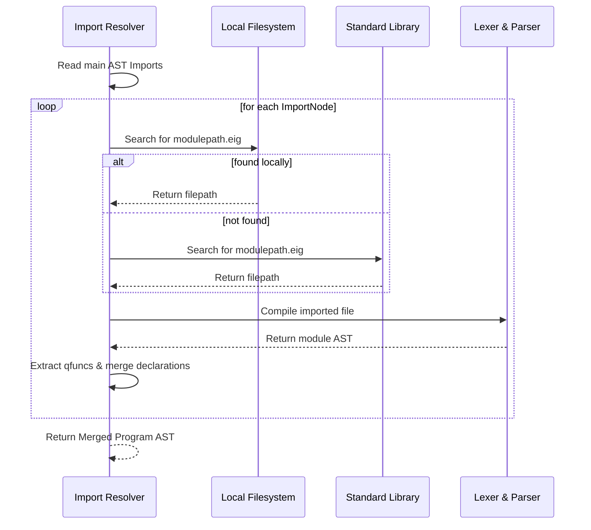

# Eigen Compiler Design

This document details the design of the compilation pipeline for the Eigen compiler frontend.

## 1. Lexical Analysis (`lexer.py`)

The Lexer is implemented as a character-by-character scanner. It scans the source string and generates a sequence of `Token` objects.

### Token Layout
Each `Token` holds:
- **`type`**: A `TokenType` enum value identifying its grammatical role.
- **`value`**: The raw string slice matching the token.
- **`line`**: The 1-based line number of the match.
- **`column`**: The 1-based column offset within the line.

### Scanning Algorithm
1. **Whitespace & Comments**: Skips whitespace (` `, `\t`, `\r`, `\n`) and updates coordinates. Comments starting with `#` or `//` skip characters until a newline.
2. **Numeric Literals**: Identifies integers (`\d+`) and floats (`\d+\.\d+`).
3. **Identifiers & Keywords**: Matches `[a-zA-Z_][a-zA-Z0-9_\.]*`. Note that dotted identifiers are tokenized as a single `IDENTIFIER` (e.g. `quantum.bell`) to simplify import resolution.
4. **Delimiters & Operators**: Matches operators (`->`, `==`, `=`, `+`, `-`, `*`, `/`) and symbols (`(`, `)`, `{`, `}`, `,`, `:`).

---

## 2. Syntactic Analysis (`parser.py`)

The Parser is implemented as a recursive descent parser. It translates the token sequence into an Abstract Syntax Tree (AST) rooted at `ProgramNode`.

### Abstract Syntax Tree (AST) Nodes
- **`ProgramNode`**: Root of the file, holds version information, module name, imports, and statements.
- **`ImportNode`**: Captures imported module paths.
- **`QFuncDeclNode`**: Declares quantum subroutines with typed parameters.
- **`LetNode`**: Binds a variable identifier to an expression.
- **`VarDeclNode`**: Allocates a qubit or classical bit.
- **`BinaryOpNode`**: Represents classical arithmetic expressions.
- **`QFuncCallNode`**: Triggers a subroutine invocation.
- **`GateNode`**: Holds gate operations, target qubits, and angle expressions.
- **`MeasureNode`**: Maps qubit state collapse to classical memory.
- **`IfNode`**: Conditional execution block.

### Operator Precedence Parsing
To parse mathematical expressions (like `PI / 2 + 0.1` for gate rotations), the parser handles operator precedence explicitly using a Pratt-style precedence hierarchy:
1. **Primary**: Literals, constant variables (`PI`, `TAU`, `E`), identifier references, parenthesized sub-expressions, or prefix signs (`-`, `+`).
2. **Multiplicative**: Multiplications (`*`) and divisions (`/`).
3. **Additive**: Additions (`+`) and subtractions (`-`).

---

## 3. Modular Import Resolution (`import_resolver.py`)

The `ImportResolver` consolidates multi-file modules into a single, merged AST.

### Inlining Subroutine Declarations
During import resolution:
1. The resolver extracts all `QFuncDeclNode` nodes from the imported ASTs.
2. It appends these declarations to the beginning of the main program AST's body.
3. This creates a global subroutine registry, ensuring that subsequent calls (e.g. `bell(q0, q1)`) find their corresponding declarations during semantic analysis and code generation.
4. Circular imports are prevented by tracking visited modules in a set.
