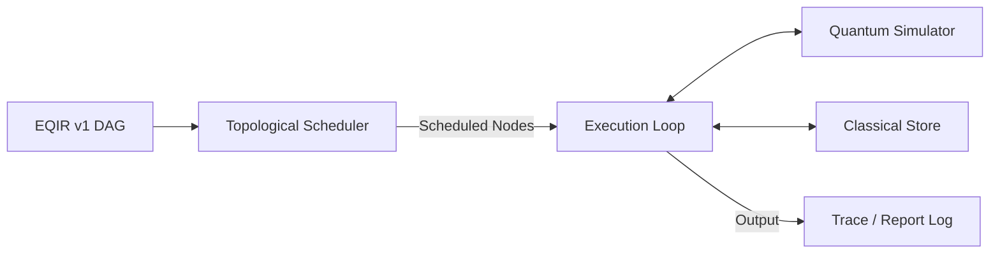

# Eigen Runtime Specification

This document details the architecture and operational mechanics of the **Eigen Runtime** execution engine.

## 1. Execution Engine Architecture

The Eigen Runtime is responsible for executing the compiled and optimized EQIR v1 DAG. 

### Topological Scheduling
Since the EQIR graph is a Directed Acyclic Graph, the execution order is determined by a topological sort. Nodes are executed such that for any edge \(U \to V\), operation \(U\) is executed before operation \(V\). If multiple execution orders are valid, the runtime uses a deterministic tie-breaker based on node IDs.

---

## 2. Classical Variable Store

The runtime maintains a classical memory space (`classical_store`) that stores:
- Classic variables declared via `let` (resolved statically during compilation if constant, or updated dynamically).
- Classical bits (`cbit`) allocated in the source file.
- Dynamic measurement results.

### Conditional Branch Evaluation
For conditional nodes (`if c0 == 1`), the runtime evaluates the condition dynamically:
1. It reads the current value of the condition variable (e.g. `c0`) from the classical store.
2. It compares it against the target value.
3. If the condition is met, the node executes. Otherwise, the runtime skips the node and all of its dependent conditional nodes.

---

## 3. Execution Tracing and Visualization

When launched with the `--trace` flag, the runtime outputs step-by-step state information for each executed node.

### 3.1 Trace Log Format
- **Allocations**: Logs new qubit declarations (e.g. `[TRACE] Allocated qubit: 'q0'`).
- **Gate Applications**: Logs gate operations and lists the non-zero amplitudes of the state vector:
  `[TRACE] Applied gate: H on q0`
  `[TRACE]   Current Quantum State: 0.70711 * |00> (prob=50.0%) + 0.70711 * |10> (prob=50.0%)`
- **Measurements**: Logs collapsed outcomes:
  `[TRACE] Measured qubit 'q0' -> stored in cbit 'c0' (value: 0)`
  `[TRACE]   Current Quantum State: 1.00000 * |00> (prob=100.0%)`

### 3.2 State Formatting Rules
- Amplitudes are formatted as complex numbers. Purely real values omit the imaginary part, and purely imaginary values omit the real part.
- Probabilities are displayed as percentages: \(P(i) = |\alpha_i|^2 \times 100\%\).
- Amplitudes with magnitudes below \(10^{-12}\) are omitted from the trace report to ensure clean visualizations.
