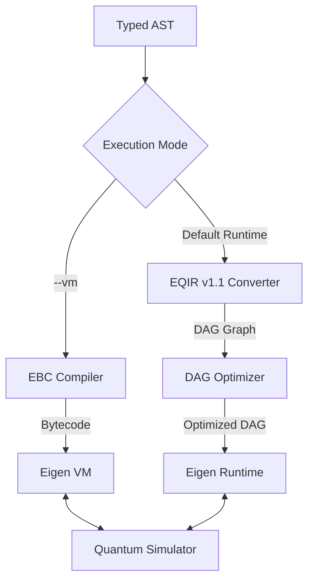

# Eigen 2.1 Runtime & VM Specification

This document details the architecture and operational mechanics of the **Eigen Runtime** and the **Eigen VM** execution engines.

## 1. Execution Engine Architecture

Eigen supports two distinct execution paths: the **EQIR v1.1 topological runtime** (for optimized quantum circuits) and the **Eigen VM** (for classical-quantum hybrid applications).

### 1.1 Eigen VM (EBC Execution)
The Eigen VM is a stack-based virtual machine designed to execute **Eigen Bytecode (EBC)**. It consists of:
- **Call Stack**: A stack of activation frames. Each frame holds local variables, parameter scopes, and the instruction pointer (`ip`).
- **Heap**: Stores dynamically allocated objects like structs, maps, arrays, and string literals.
- **Exception Stack**: Tracks try-catch handler offsets. When an exception is thrown, the VM unwinds activation frames until it finds the closest catch offset or aborts execution with a stack trace.

### 1.2 EQIR v1.1 Runtime
The topological runtime executes static, inlined quantum DAGs:
- **Topological Scheduling**: Sorts the EQIR v1.1 graph to run independent gates in parallel or deterministic sequential order.
- **Classical Store**: Stores state vectors and measurement outcomes for basic conditional branches (`if cbit == 1`).

---

## 2. Quantum Simulator Integration

Both the VM and the Runtime integrate with the `simulator.py` core to execute quantum gates:
- **State Vector Representation**: Manages the system wavefunction as a 1D array of \(2^N\) complex amplitudes.
- **Unitary Gate Application**: Computes Kronecker products of gates and multiplies them against the state vector.
- **Measurement and Wavefunction Collapse**: Collapses the wavefunction probabilistically and returns classical bit outcomes.
- **Decoherence Noise**: Integrates depolarizing and bitflip noise channels directly into the state-vector transformations.

---

## 3. Tracing and Debugging

When launched with the `--trace` flag, both engines output detailed step-by-step state information:
- **Allocations**: `[TRACE] Allocated qubit: 'q0'`
- **Gate Applications**: Logs the updated non-zero amplitudes of the state vector:
  `[TRACE] Applied gate: H on q0`
  `[TRACE]   Current Quantum State: 0.70711 * |00> (prob=50.0%) + 0.70711 * |10> (prob=50.0%)`
- **Measurements**: Logs collapsed outcomes and probabilities.
- **Noise Channels**: Logs noise application:
  `[TRACE] Applied bitflip noise (X) on 'q0'`

---

## 4. Runtime Guarantees and Backend Compatibility Matrix

### Runtime Guarantees
The Eigen VM guarantees complete runtime execution of all classical-quantum hybrid operations. Recursion, dynamic heap allocations, structural access, and try-catch scoping are fully executable.

### Target Support Matrix
| Feature / Subsystem | Eigen VM | topological Runtime | Qiskit Exporter |
| --- | --- | --- | --- |
| Quantum Gate Simulation | `FULL` | `FULL` | `FULL` |
| Noise Channels | `FULL` | `NONE` | `NONE` |
| Subroutine Inlining | `NONE` (Dynamic call stack) | `FULL` (Static inline) | `FULL` (Inline fallback) |
| Structs / Maps Heap | `FULL` | `NONE` | `NONE` |
| Recursion (Stack) | `FULL` | `NONE` | `NONE` |
| Try-Catch Unwinding | `FULL` | `NONE` | `NONE` |
